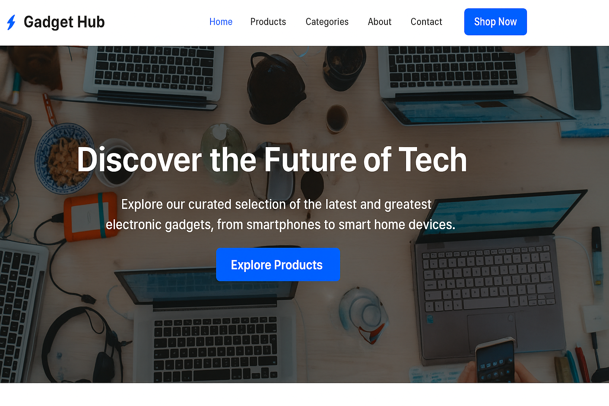

## ⚡️ Gadget Hub
Gadget Hub is a modern, responsive e-commerce web application designed to showcase and sell the latest electronic gadgets. Built with HTML, CSS, and JavaScript, it features a sleek UI with smooth animations, a dynamic cart system, and a quick-view modal for enhanced user experience. The app is optimized for performance and accessibility across various devices and browsers.

## 🚀 Live Demo
For a live demo:-

## 📸 Screenshots

## ✨ Features
- ✅ Browse a wide range of electronic gadgets with detailed product cards.
- 🛒 Add products to a dynamic cart with real-time updates and animated transitions.
- 🔍 Quick-view modal for instant product details without leaving the page.
- 📱 Fully responsive design for seamless use on mobile, tablet, and desktop devices.
- 🎨 Modern UI with gradient backgrounds, subtle animations, and a testimonial slider.
- 🧭 Sticky navigation with smooth scrolling and active link highlighting.
- 🗂️ Organized product categories for easy browsing.
- 📢 Customer testimonials to build trust and credibility.

## 🧠 How It Works
- Gadget Hub displays products in a grid layout with featured and new arrival sections.
- Users can explore products by category, view details via a quick-view modal, or add items to the cart.
- The cart system uses local storage to persist items, with a mini-cart sidebar for easy access.
- A testimonial slider automatically cycles through customer reviews with manual controls.
- Smooth scrolling and sticky navigation enhance the browsing experience.
- The footer provides contact details, quick links, and social media connections.

## 🛠️ Built With
- HTML5
- CSS3 (Gradient Backgrounds, Responsive Design, Animations, Custom Scrollbar)
- JavaScript (ES6+)
- Font Awesome (https://fontawesome.com/) for icons
- Google Fonts (https://fonts.google.com/) – Inter
- Unsplash (https://unsplash.com/) for high-quality images

## 🧰 Getting Started
- To run this project locally:-
- Clone the repo: git clone https://github.com/Poorna-Sai-Sriharsha/Gadget-Hub.git 
- Navigate to the project directory: cd GadgetHub
- Open index.html in a browser or use a local server (e.g., npx live-server) for the best experience.
- Note: No additional dependencies are required, as all libraries are included via CDNs.

## 🧪 Testing & Deployment
- Tested for compatibility across Chrome, Firefox, Safari, and Edge.
- Verified responsive design on mobile (iOS, Android) and desktop devices.
- Deployed using GitHub Pages for seamless access and live demo availability.

## 📖 What I Learned
- Mastered responsive grid layouts and CSS animations for engaging UI design.
- Implemented a dynamic cart system with local storage for persistent data.
- Enhanced skills in JavaScript event handling for modals, sliders, and navigation.
- Overcame challenges in ensuring cross-browser compatibility and mobile responsiveness.
- Learned to optimize performance with efficient DOM manipulation and event delegation.

## 🤝 Contributing
- Contributions are welcome! Please fork the repository and submit a pull request with your changes. For major updates, open an issue first to discuss your ideas.
